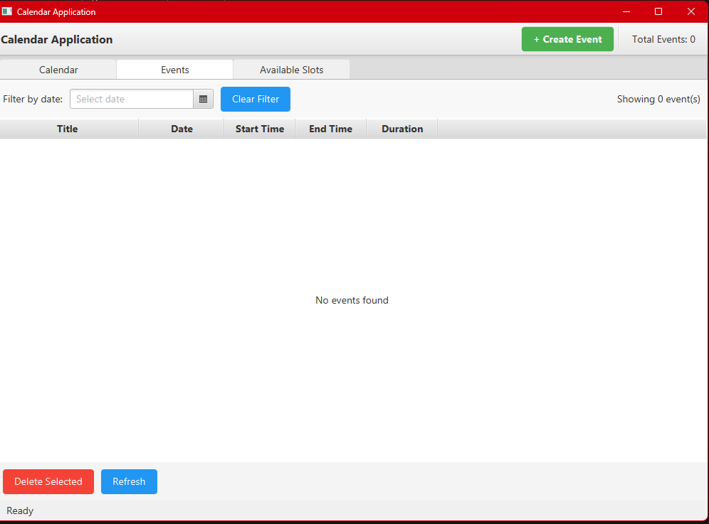
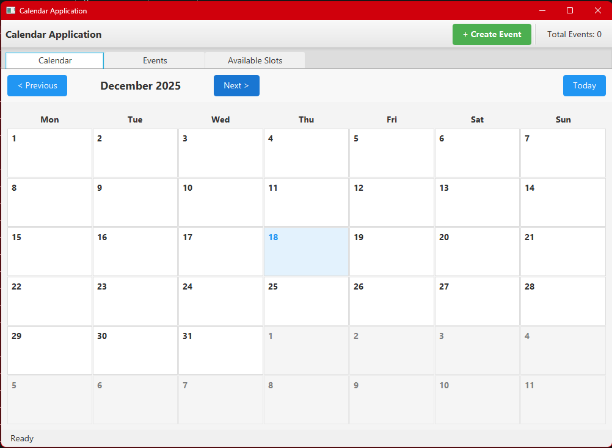
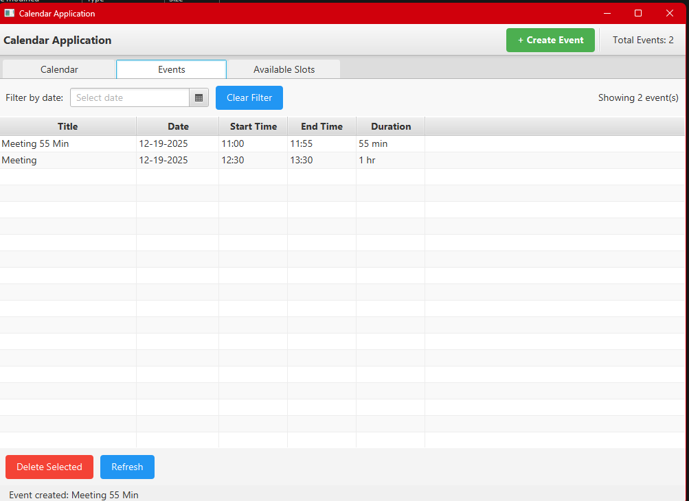
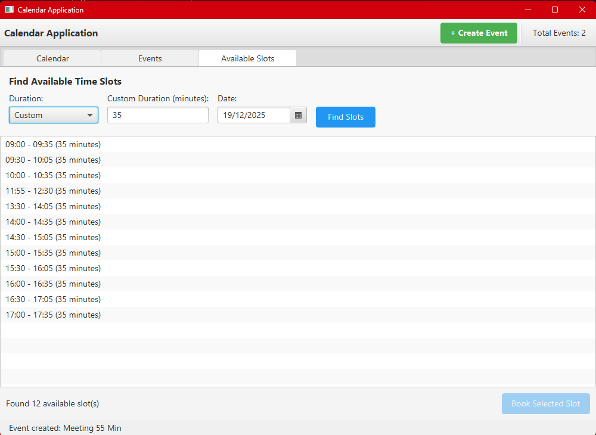
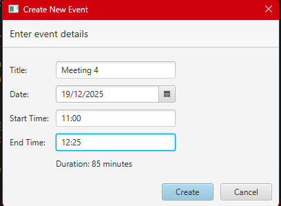
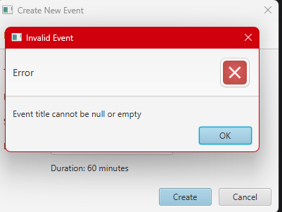
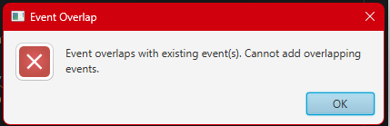
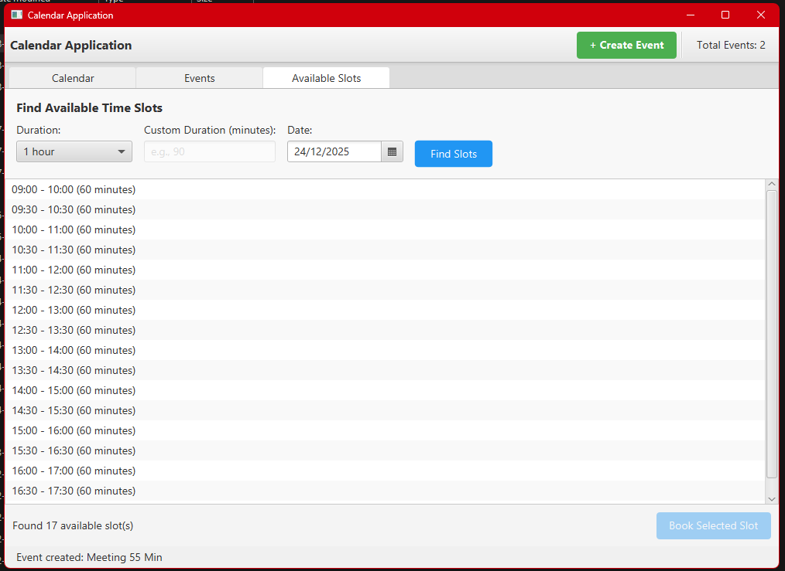
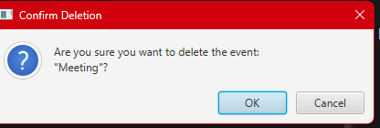
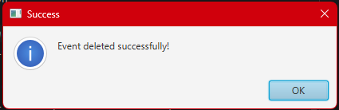

# Calendar Application - GUI User Guide

A JavaFX-based graphical calendar management system with event scheduling, overlap detection, and intelligent slot finding.

## Table of Contents
- [Features](#features)
- [Getting Started](#getting-started)
- [User Interface Overview](#user-interface-overview)
- [Using the Application](#using-the-application)

## Features

- **Visual Calendar View**: Interactive monthly calendar grid with color-coded events
- **Event Management**: Create, view, and delete events with full validation
- **Overlap Prevention**: Automatic detection and prevention of scheduling conflicts
- **Smart Slot Finding**: Discover available time slots based on your existing schedule
- **Dual Interface**: Both CLI and GUI versions available
- **Real-time Updates**: All views automatically refresh when events change

## Getting Started

### Prerequisites

- Java 11 or higher
- Maven 3.6+
- JavaFX SDK (automatically managed by Maven)

### Running the GUI Application

```bash
# Using Maven (recommended)
mvn javafx:run

# Or build and run the JAR
mvn clean package
java -jar target/calendar-gui-jar-with-dependencies.jar
```

## User Interface Overview

The application features a tabbed interface with three main sections:


*Main application window with tabbed navigation*


### 1. Calendar View Tab

The Calendar View displays a monthly grid showing all your scheduled events.



*Monthly calendar view with events displayed in their time slots*

**Features:**
- Month/Year navigation controls
- Color-coded event blocks
- Click on dates to view events
- Visual indication of event density

### 2. Event List Tab

The Event List provides a detailed table view of all events with management capabilities.

 
*Tabular event list with sorting and deletion capabilities*

**Features:**
- Sortable columns (Date, Time, Title, Location)
- Search and filter events
- Delete events with confirmation
- Double-click to view event details

### 3. Available Slots Tab

The Available Slots finder helps you discover free time in your schedule.

 
*Slot finder interface showing available time windows*

**Features:**
- Date picker for target date
- Duration selector (30 min, 1 hour, 2 hours, custom)
- Working hours constraint (9 AM - 6 PM)
- Quick booking from available slots

## Using the Application

### Creating an Event

1. Click the **"Add Event"** button in the toolbar
2. Fill in the event details:
   - **Title**: Event name (required)
   - **Start Date & Time**: When the event begins
   - **End Date & Time**: When the event ends
   - **Location**: Where the event takes place (optional)
   - **Description**: Additional details (optional)

 
*Event creation form with validation*

3. Click **"Save"** to create the event


**Validation Rules:**
- Title cannot be empty
- End time must be after start time
- Event cannot overlap with existing events



### Overlap Detection

The system automatically prevents scheduling conflicts.



*Alert shown when attempting to create an overlapping event*

When you try to create an event that conflicts with an existing one:
- An error dialog appears with details
- The conflicting event information is displayed
- The new event is not created
- You can adjust times and try again

**Example Overlap Scenarios:**
```
Existing Event: 12-15-2025 10:00 - 12:00 (Team Meeting)

❌ OVERLAPS: 12-15-2025 11:00 - 13:00 (New event starts during existing)
❌ OVERLAPS: 12-15-2025 09:00 - 11:00 (New event ends during existing)
❌ OVERLAPS: 12-15-2025 09:00 - 13:00 (New event completely contains existing)
✅ OK: 12-15-2025 12:00 - 14:00 (Starts exactly when previous ends)
```

### Finding Available Time Slots

Use the Available Slots feature to find free time in your schedule:

1. Switch to the **"Available Slots"** tab
2. Select a date using the date picker
3. Choose desired duration:
   - 30 minutes
   - 1 hour
   - 2 hours
   - Custom (enter minutes)
4. Click **"Find Slots"**


*List of available time slots for selected date and duration*

The system shows all available slots:
- Before your first event of the day
- Between consecutive events
- After your last event of the day
- Only within working hours (9 AM - 6 PM)
- In 30-minute increments

**Quick Booking:**
Select a slot and click **"Book Selected Slot"** to immediately create an event.

*Quick event creation from available slot*

### Deleting an Event

1. Go to the **"Event List"** tab
2. Select the event you want to delete
3. Click the **"Delete"** button



*Confirmation dialog before deleting an event*

4. Confirm the deletion in the dialog
5. The event is removed and all views update automatically

### Success Notifications

The application provides clear feedback for all operations:

 

*Success confirmation after creating an event*

## Architecture

### Components

```
CalendarGuiApp (Entry Point)
    ↓
MainWindowController (Coordinator)
    ↓
    ├── CalendarViewController (Monthly grid display)
    ├── EventListController (Table view & deletion)
    └── AvailableSlotsController (Slot finding & booking)

All controllers share:
    CalendarServiceImpl (Business logic)
        ↓
    InMemoryEventStorage (Data storage)
```

### Key Technologies

- **JavaFX**: GUI framework with FXML for view definitions
- **CSS**: Custom styling for calendar components
- **Observer Pattern**: DataChangeListener for automatic view updates
- **Dependency Injection**: ServiceFactory wires components

### File Structure

```
src/main/java/com/calendar/
├── gui/
│   ├── CalendarGuiApp.java          # Application entry point
│   ├── controller/
│   │   ├── MainWindowController.java
│   │   ├── CalendarViewController.java
│   │   ├── EventListController.java
│   │   └── AvailableSlotsController.java
│   └── util/
│       └── AlertUtil.java            # Consistent alert dialogs
├── model/                            # Event and TimeSlot classes
├── service/                          # Business logic and storage
└── factory/                          # Dependency injection

src/main/resources/com/calendar/gui/
├── view/                             # FXML view definitions
└── css/                              # Stylesheets
```

## Date and Time Formats

The application uses consistent formats throughout:

- **Date Input**: `MM-dd-yyyy` (e.g., `12-15-2025`)
- **DateTime Input**: `MM-dd-yyyy HH:mm` (e.g., `12-15-2025 14:30`)
- **Time Display**: `HH:mm` (24-hour format)

## Limitations

- **No Persistence**: Events are stored in-memory only and lost when the application closes
- **Single User**: No multi-user support or calendar sharing
- **Fixed Working Hours**: Slot finder limited to 9 AM - 6 PM
- **No Event Editing**: Events must be deleted and recreated to modify
- **No Recurring Events**: Each event must be created individually

## Tips for Best Experience

- **Date Format**: Always use `MM-dd-yyyy HH:mm` format when entering dates and times
- **Working Hours**: Available slots are only shown for 9 AM - 6 PM
- **Custom Duration**: Enter duration in minutes (e.g., `45` for 45 minutes, `90` for 1.5 hours)
- **Automatic Updates**: All views refresh automatically when you create or delete events

## Building from Source

```bash
# Clone the repository
git clone <repository-url>
cd Calender

# Build both CLI and GUI JARs
mvn clean package

# Run tests
mvn test

# Launch GUI
mvn javafx:run
```

## Future Enhancements

- Persistent storage (file or database)
- Event editing capabilities
- Recurring event support
- Export to iCal/Google Calendar
- Multi-user calendar sharing
- Customizable working hours
- Reminder notifications
- Dark mode theme
